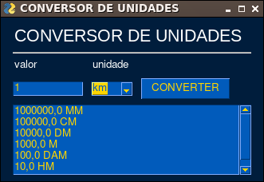

# Conversor-de-Unidades

Este conversor de unidades com interface gráfica e feito inteiramente em python, é totalmente expansível. Você pode adicionar novas funcionalidades editando o arquivo [Conversor.py](Conversor.py) na variável *self.unidades = []* e adicionando novos *if's* na função *def conversor(self, unidade, valorInicial):* com um editor de texto...

## Como instalar o conversor

Primeiramente instale o [Python](https://www.python.org/downloads/) e o [GIT](https://git-scm.com/downloads).

Clone meu projeto, crie uma VENV ([leia aqui](https://docs.python.org/3/library/venv.html) para saber o que é isso!) e instale as dependências usando os comandos abaixo pelo terminal/prompt:

### No Linux ou MAC OS:

~~~
git clone https://github.com/elizeubarbosaabreu/Conversor-de-Unidades
cd Conversor-de-Unidades
python3 -m venv .venv
source .venv/bin/activate
pip install -r requirements.txt 

~~~

### No Windows:

~~~
git clone https://github.com/elizeubarbosaabreu/Conversor-de-Unidades
cd Conversor-de-Unidades
python -m venv .venv
source .venv/Scripts/Activate
pip install -r requirements.txt 

~~~

## Executando

Ainda dentro da VENV use o comando:

~~~
python app.py
~~~
